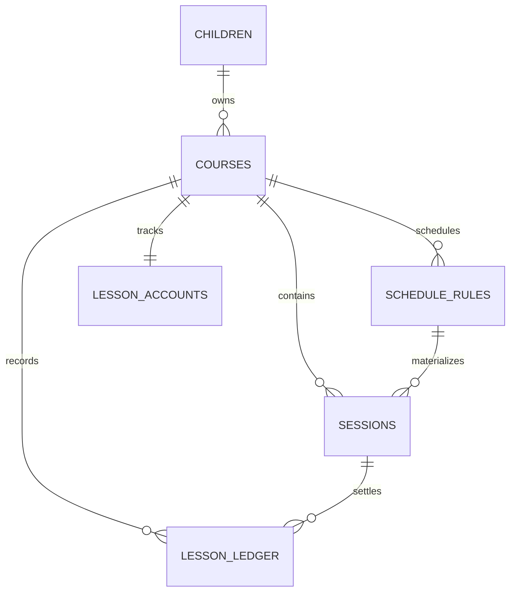

# 课程日历 Web App 产品与技术设计

> 文档状态：实施前方案  
> 更新日期：2026-09-01  
> 适用仓库：`course-calendar`

## 1. 文档目标

本项目将建设一个移动端优先、同时适配桌面端并可安装为 PWA 的课程日历，用于记录孩子每天的上课安排、请假情况和剩余课时。

本方案先定义产品范围、交互方式、领域规则、数据模型、技术架构和实施顺序。方案确认后再进入功能开发。

## 2. 源码现状

已在编写本方案前阅读仓库中的应用源码、包配置、构建配置和数据库配置。当前状态如下：

| 区域 | 已有能力 | 当前缺口 |
| --- | --- | --- |
| `apps/web` | React 19、Vite、TanStack Router、TanStack Query、tRPC 客户端、Tailwind CSS、shadcn/ui、暗色模式 | 只有 API 健康检查页，暂无日历、课程表单和业务状态 |
| PWA | 已接入 `vite-plugin-pwa` 和资源生成器 | manifest 仍是占位内容；缺少正式图标、安装引导、离线数据策略和更新提示 |
| `apps/server` | Hono、tRPC、CORS、Node.js 服务 | 只有通用 tRPC 入口，无业务接口 |
| `packages/api` | tRPC context 和 router 基础结构 | 只有 `healthCheck`；无输入校验、课程和日历模块 |
| `packages/db` | Drizzle ORM、Neon Postgres 接入 | schema 为空，无迁移和种子数据 |
| `packages/ui` | shadcn/ui 基础原语、主题 token | 缺少 Dialog/Sheet/Select 等业务所需原语和日历专用样式 |
| 工程化 | pnpm workspace、Turborepo、TypeScript、Biome、Lefthook | 暂无单元测试、接口集成测试和端到端测试 |
| 身份与隔离 | context 中预留了 `auth`、`session` | 当前没有登录与数据隔离能力 |

当前工作区中 `apps/web/src/routes/index.tsx` 存在用户尚未提交的改动；实施时应保留该改动并在其基础上继续开发。

## 3. 产品原则与首版假设

### 3.1 产品原则

1. **一眼看懂本周**：打开应用直接看到本周课程、今天位置和异常状态。
2. **高频操作不超过两步**：课程详情、请假、回到今天、增加课程均可从日历主页快速完成。
3. **课时账可解释**：任何余额变化都有来源，避免只维护一个可能被重复扣减的数字。
4. **移动端先可用，再扩展大屏**：触控区域、底部操作区、刘海屏安全区域优先；桌面端利用更宽空间展示完整七日。
5. **弱网下不丢信息**：PWA 至少可打开应用并查看最近缓存的课程；离线写入在后续阶段增强。

### 3.2 首版默认假设

- 首版面向一个家庭使用，默认时区为 `Asia/Shanghai`，界面语言为简体中文。
- 数据模型从第一天支持多个孩子，但首版界面可先使用一个默认孩子，避免增加不必要的切换步骤。
- “1 课时”是余额单位；每节课程默认消耗 1 课时，也允许设置为 0.5、1.5 等值。
- 正常完成和未请假的缺席会消耗课时；请假、机构取消不消耗课时。
- 请假后该课程仍保留在日历中，以“已请假”状态显示，不直接删除，便于追溯和撤销。
- 手动增加课程包括“课程资料 + 剩余课时 + 上课地点 + 上课时间”；支持每周重复和仅一次两种安排。
- 在没有身份系统前，只适合本地或受保护的私有部署。若公开部署，登录与家庭数据隔离是上线前置条件。

## 4. 功能范围

### 4.1 P0：首个可用版本

#### 日历

- 默认进入本周视图，显示周一至周日。
- 显示时间轴、当前时间线、今天高亮、课程色块、课程名称、时间和地点。
- 支持上一周、下一周、回到今天。
- 移动端支持横向滑动查看一周各天，纵向滚动时间轴；桌面端一次展示完整七天。
- 点击课程色块打开课程实例详情。
- 无课程时显示清晰的空状态和“添加课程”入口。

#### 课程管理

- 手动新增、编辑、停用课程。
- 字段：孩子、课程名称、颜色、地点、开始时间、结束时间、开始日期、重复规则、初始剩余课时、单次消耗课时、备注。
- 支持“每周重复”和“仅一次”。首版每周重复支持选择一个或多个星期。
- 课程停用只停止生成未来课程，不删除历史记录。

#### 剩余课时

- 首页课程色块或详情中显示剩余课时。
- 课程列表汇总展示所有有效课程的余额。
- 正常结课或未请假缺席后扣减；请假、机构取消不扣减。
- 支持手动增加、减少或修正课时，要求填写原因。
- 余额不足或接近阈值时突出提示，但不阻止已有课程展示。

#### 请假

- 课程详情提供醒目的“请假”按钮。
- 点击后进行轻量确认，成功后立即显示“已请假”，并提供短时撤销入口。
- 已请假的课程不计入已消耗课时。
- 支持撤销请假；已发生课程的状态修正需要二次确认并留下记录。

#### PWA

- 支持添加到主屏幕，使用正式应用名称、图标、主题色和启动画面。
- 使用 standalone 模式和移动端安全区域。
- 缓存应用外壳；离线时能打开应用并查看最近成功加载的数据。
- 检测到新版本时给出更新提示，避免用户长期使用旧资源。
- 离线状态明确提示；P0 的写操作需要联网，不做“看似成功、实际未提交”的假反馈。

### 4.2 P1：高价值扩展

- 多孩子档案、头像和日历筛选。
- 月视图、日程列表视图、今日小组件。
- 课程包续费、分次购课、有效期和低余额提醒。
- 到课、迟到、请假、缺席、机构取消等完整出勤记录。
- 课程提醒和请假截止时间提醒；支持 Web Push 时再开启推送。
- 临时调课：只改本次时间或地点，不影响后续重复课程。
- 补课关联：将请假课与补课实例关联，但只按实际结课扣减一次。
- 搜索、按孩子或课程筛选、课程备注和老师联系方式。
- 离线创建/请假队列，联网后自动同步并处理冲突。

### 4.3 P2：后续拓展

- 家庭成员邀请、角色权限和操作审计。
- 导入/导出 ICS，与 Apple Calendar、Google Calendar 等外部日历单向或双向同步。
- 机构课表图片/OCR 导入和批量确认。
- 课时消费统计、月度上课报告、费用折算。
- 数据导出、备份与恢复。
- 多语言、多时区和跨时区课程。
- 桌面/移动端小组件及应用角标。

### 4.4 首版明确不做

- 复杂的按月、按学期或农历重复规则。
- 教培机构后台、在线支付、老师端或排课审批流。
- 未经用户确认的自动 OCR 入库。
- 多端实时协作编辑。

## 5. 信息架构与交互设计

### 5.1 页面结构

| 页面 | 主要内容 | 移动端入口 |
| --- | --- | --- |
| 本周日历 `/` | 周导航、时间网格、课程实例、今日定位 | 底部导航“日历” |
| 课程列表 `/courses` | 课程、孩子、地点、剩余课时、低余额状态 | 底部导航“课程” |
| 新增/编辑课程 | 表单、重复规则、初始课时 | 首页悬浮按钮或课程页按钮，以底部 Sheet 打开 |
| 课程实例详情 | 本次时间、地点、状态、剩余课时、请假/撤销 | 点击日历课程色块，以底部 Sheet 打开 |
| 课程详情 `/courses/$courseId` | 基本资料、余额流水、未来安排、编辑/停用 | 点击课程列表项 |

设置在首版内容较少时放入顶部菜单，不额外占用底部导航项。

### 5.2 周视图响应式规则

周视图借鉴 Apple Calendar 的时间轴认知和 Notion Calendar 的紧凑课程块，但不直接复制视觉细节。

- 顶栏固定：当前年月、回到今天、上一周/下一周、主题菜单。
- 日期栏固定：星期、日期、今天高亮；滚动时间轴时仍可见。
- 手机竖屏：日期列保持约 112–128px 最小宽度，时间网格横向滚动，视口同时看到约 2–3 天；首次进入自动定位到今天。日期栏与网格共享同一水平滚动状态。
- 平板和桌面：七列自动填满可用宽度；左侧时间刻度固定。
- 时间网格按 30 分钟分割，默认滚动到首节课程前约一小时；全天无课时定位到 08:00。
- 重叠课程并排排列；极窄空间只显示课程名和开始时间，地点放到详情中。
- 课程状态同时使用文字/图标/样式表达，不能只依赖颜色区分。

### 5.3 关键交互

#### 请假

1. 点击课程实例。
2. 底部详情 Sheet 显示本次课程及当前剩余课时。
3. 点击“请假”，确认提示明确写出“本次不扣除 X 课时”。
4. 成功后课程变为低饱和/虚线样式并显示“已请假”，Toast 提供撤销。

#### 新增课程

1. 点击悬浮 `+`。
2. 分两段填写：课程资料；时间与课时。
3. 保存前展示简短摘要，例如“每周二 17:00，剩余 12 课时”。
4. 保存后回到对应周并高亮新课程。

#### 调整课时

1. 进入课程详情，点击余额旁的“调整”。
2. 选择增加/减少，填写数量和原因。
3. 保存后显示新余额，并在流水中保留调整前后信息。

### 5.4 无障碍与移动体验

- 可点击区域至少 44×44 CSS px。
- 支持键盘导航、可见焦点、屏幕阅读器标签和减少动态效果偏好。
- 课程文字与背景达到可读对比度；颜色由设计 token 统一生成浅色/深色变体。
- 使用 `100dvh` 和 `env(safe-area-inset-*)` 适配 iOS 地址栏、刘海和主屏幕模式。
- 表单错误显示在字段附近，保存按钮在移动端固定于底部安全区域之上。

## 6. 领域模型与业务规则

### 6.1 核心概念

| 概念 | 说明 |
| --- | --- |
| Child | 孩子档案，课程归属主体 |
| Course | 课程资料，例如“游泳”；包含默认地点、颜色和单次消耗 |
| ScheduleRule | 重复安排，描述从某天起每周哪些星期、几点上课 |
| Session | 一次具体课程实例；请假、调课和完成状态都发生在实例上 |
| LessonAccount | 一门课程的课时账户及显示配置 |
| LessonLedger | 不可覆盖的课时流水；购课、结课扣减和手动调整均生成记录 |

### 6.2 课程实例状态

| 状态 | 是否扣课时 | 说明 |
| --- | --- | --- |
| `scheduled` | 否 | 未来待上课 |
| `completed` | 是 | 正常完成 |
| `leave` | 否 | 家长请假，可撤销 |
| `absent` | 是 | 未请假缺席，默认视同机构扣课时 |
| `cancelled` | 否 | 机构取消 |

首版可只在界面暴露“待上课、已完成、已请假、已取消”，但数据库状态预留 `absent`，避免后续迁移破坏历史数据。

### 6.3 余额规则

余额不作为可以随意覆盖的单个字段，而由课时流水汇总：

```text
剩余课时 = 购课/初始入账 + 手动增加 - 手动减少 - 已结算课程消耗
```

- 课时在数据库中使用整数最小单位保存，例如 `100 = 1.00 课时`，避免浮点误差。
- Session 保存 `costUnits` 快照；以后修改课程默认消耗，不影响历史实例。
- Session 保存地点、时间和课程名必要快照；以后修改课程资料，不改写历史事实。
- 对同一 Session 的消费流水设置唯一约束，保证重复请求不会重复扣减。
- 从 `completed` 改为 `leave/cancelled` 时不删除旧流水，而追加冲正流水，保持可审计。
- 余额可以为负数以反映真实数据，但界面必须给出警告；不静默截断为 0。

### 6.4 重复课程生成

不在数据库中一次性生成无限未来课程。日历模块在读取时间窗口时保证该窗口内实例存在：

- 按 ScheduleRule 为请求周生成确定性的 Session。
- 使用 `(scheduleRuleId, occurrenceDate)` 唯一约束保证幂等。
- 默认按“过去 2 周到未来 12 周”的滚动窗口预生成，也可以按用户访问的周补齐。
- 修改重复课程时明确区分“仅本次”和“本次及后续”；历史 Session 不被重写。

## 7. 数据库设计

建议的首版表结构如下，正式实现时使用 Drizzle schema 和生成的 SQL migration 管理。

### 7.1 主要表

#### `children`

- `id` UUID PK
- `name` text
- `avatar_url` text nullable
- `color` text nullable
- `created_at` / `updated_at` timestamptz

#### `courses`

- `id` UUID PK
- `child_id` FK → `children.id`
- `name` text
- `color` text
- `default_location` text nullable
- `default_cost_units` integer，默认 100
- `timezone` text，默认 `Asia/Shanghai`
- `notes` text nullable
- `status`：`active | archived`
- `created_at` / `updated_at` timestamptz

#### `schedule_rules`

- `id` UUID PK
- `course_id` FK → `courses.id`
- `start_date` date
- `end_date` date nullable
- `weekdays` smallint array 或单独关联表
- `local_start_time` time
- `duration_minutes` integer
- `is_active` boolean
- `created_at` / `updated_at` timestamptz

#### `sessions`

- `id` UUID PK
- `course_id` FK → `courses.id`
- `schedule_rule_id` FK nullable；一次性课程为空
- `occurrence_date` date
- `starts_at` / `ends_at` timestamptz
- `course_name_snapshot` text
- `location_snapshot` text nullable
- `cost_units` integer
- `status`：`scheduled | completed | leave | absent | cancelled`
- `status_reason` text nullable
- `settled_at` timestamptz nullable
- `created_at` / `updated_at` timestamptz
- 唯一索引：`(schedule_rule_id, occurrence_date)`，忽略 `schedule_rule_id IS NULL`
- 查询索引：`(starts_at)`、`(course_id, starts_at)`、`(status, starts_at)`

#### `lesson_accounts`

- `course_id` PK/FK → `courses.id`
- `low_balance_units` integer，默认 300
- `updated_at` timestamptz

#### `lesson_ledger`

- `id` UUID PK
- `course_id` FK → `courses.id`
- `session_id` FK nullable
- `kind`：`initial | purchase | consumption | reversal | adjustment`
- `delta_units` integer；入账为正，消费为负
- `reason` text nullable
- `idempotency_key` text unique
- `created_at` timestamptz
- 查询索引：`(course_id, created_at)`

### 7.2 关系概览



### 7.3 一致性要求

- Session 状态变化和课时流水变更必须在同一数据库事务中完成。
- 所有 mutation 接受客户端生成的幂等键，防止用户连点、重试或弱网导致重复写入。
- 对课程、Session 和流水使用数据库约束兜底，不只依赖前端校验。
- 日历查询只返回所需时间窗口，避免把全部历史数据加载到客户端。
- 删除课程使用归档；历史 Session 和流水不做级联物理删除。

## 8. 技术方案

### 8.1 沿用现有技术栈

不更换当前脚手架，按现有 monorepo 继续建设：

```text
apps/web           React UI、路由、查询缓存、PWA
    │ tRPC
apps/server        Hono HTTP 入口、CORS、日志
    │
packages/api       输入校验、课程模块、日历模块、课时结算
    │ Drizzle
packages/db        Postgres schema、migration、查询实现
    │
Neon Postgres      持久化与事务

packages/ui        跨页面共享的 UI 原语和主题 token
packages/env       服务端/浏览器环境变量校验
```

### 8.2 模块与接口

业务逻辑集中在少量深模块中，tRPC router 保持为薄适配层，避免把重复规则、状态转换和扣课逻辑散落到页面或多个 procedure。

#### Calendar 模块

外部接口保持精简：

```ts
getWeek(input): Promise<WeekCalendar>
changeSessionStatus(input): Promise<SessionChangeResult>
```

实现内部负责：时间窗口补齐、重复规则实例化、时区转换、重叠课程布局所需数据、状态机校验、结算和幂等。调用方只需要理解周范围和目标状态。

#### Course 模块

```ts
listCourses(input): Promise<CourseSummary[]>
getCourse(input): Promise<CourseDetail>
saveCourse(input): Promise<CourseDetail>
archiveCourse(input): Promise<void>
adjustLessons(input): Promise<LessonBalance>
```

实现内部负责：新增/编辑差异、重复规则更新、初始课时入账、余额汇总和流水原因校验。

#### Seam 选择

- Postgres 是当前唯一生产数据源，不额外创建一层纯转发的 Repository interface。
- 纯时间计算、状态机和课时单位换算作为模块内部 seam，可直接进行确定性测试。
- 数据库行为通过真实 Postgres 测试环境验证；只有在确实引入第二个存储 adapter 时再抽象存储 port。

### 8.3 API 设计

建议 tRPC router：

```text
calendar.week
calendar.changeSessionStatus
course.list
course.byId
course.create
course.update
course.archive
course.adjustLessons
```

- 所有输入使用 Zod 校验；服务端不信任客户端传入的余额、用户归属和结算结果。
- `calendar.week` 输入使用 `weekStart: YYYY-MM-DD` 和 `timezone`，避免直接传本地 Date 字符串。
- mutation 返回变更后的 Session 和最新余额，使前端能精确更新缓存。
- tRPC error code 区分校验错误、未找到、状态冲突和网络/数据库错误。
- 后续加入登录时，将家庭归属从 context 注入模块，查询条件必须包含 `householdId`。

### 8.4 前端结构

建议按功能而不是按文件类型组织应用代码：

```text
apps/web/src/
├── routes/
│   ├── __root.tsx
│   ├── index.tsx
│   └── courses/
├── features/
│   ├── calendar/
│   │   ├── week-calendar.tsx
│   │   ├── week-header.tsx
│   │   ├── time-grid.tsx
│   │   ├── session-card.tsx
│   │   └── session-sheet.tsx
│   └── courses/
│       ├── course-form.tsx
│       ├── course-list.tsx
│       └── lesson-ledger.tsx
├── components/
│   ├── app-shell.tsx
│   ├── bottom-nav.tsx
│   └── pwa-update-prompt.tsx
└── lib/
    ├── dates.ts
    └── lesson-units.ts
```

- TanStack Router 负责页面级加载和 URL 中的周起始日期，例如 `/?week=2026-08-31`，使前进/后退和分享链接可预测。
- TanStack Query/tRPC 管理服务端状态；表单草稿保留在局部状态，不引入额外全局状态库。
- 请假等 mutation 可做乐观更新，但失败时必须回滚 Session 和余额两个缓存。
- 日历布局使用 CSS Grid 和绝对定位完成，不在首版引入重量级通用日历库；这样可精确控制移动端同步滚动、课程色块和触控体验。
- 通用 Button、Sheet、Dialog、Form、Select 等放在 `packages/ui`；课程业务 UI 保留在 `apps/web/src/features`，避免共享包被单一应用逻辑污染。

### 8.5 日期与时区

- Postgres 中实际发生时间使用 `timestamptz`，重复规则保留本地日期、本地时间和 IANA timezone。
- 客户端只负责显示，生成重复实例和结算边界由服务端完成。
- 周起始固定为周一；所有周范围计算都显式传入时区。
- 对日期使用专门的 date utility，不散落 `new Date("YYYY-MM-DD")`，避免 UTC 解析造成日期偏移。
- 夏令时冲突策略由 Calendar 模块统一处理；默认选择该本地时间对应的较早有效瞬间，并记录测试用例。

### 8.6 PWA 与离线

在现有 `VitePWA` 配置上补充：

- 正式 `name`、`short_name`、`description`、`lang`、`start_url`、`scope`、`display: standalone`、主题色、背景色和多尺寸图标。
- Workbox 预缓存构建产物和关键静态资源，导航请求回退到应用外壳。
- 最近成功获取的周数据和课程摘要持久化到 IndexedDB；启动时先展示缓存，再后台刷新。
- tRPC 当前使用 POST batching，不能简单依赖浏览器 HTTP cache；离线读缓存应由 TanStack Query 持久化明确负责。
- P0 离线 mutation 直接阻止并说明原因；P1 再增加 outbox、Background Sync 和冲突策略。
- 生产环境关闭 Router/Query Devtools；service worker 更新使用可见提示并在用户确认后刷新。

### 8.7 安全与隐私

- 不把数据库连接串或任何服务端 secret 暴露到 `VITE_*` 环境变量。
- CORS 使用明确的生产来源，不允许通配符。
- 写操作加入速率限制、输入长度限制和结构化日志；日志不记录孩子备注等敏感正文。
- 公开部署前加入身份认证、家庭归属和授权校验；仅隐藏前端入口不构成权限控制。
- 后续提供数据导出和删除能力，并在隐私说明中明确数据用途。

## 9. 测试与质量方案

### 9.1 单元测试

- 重复规则跨月、跨年、闰日和夏令时边界。
- Session 状态机合法/非法转换。
- `completed/absent/leave/cancelled` 对余额的影响。
- 重复 mutation 的幂等性逻辑。
- 课时最小单位和显示格式转换。

### 9.2 数据库与 API 集成测试

- 并发请假或结课只能生成一次消费/冲正流水。
- 时间窗口重复补齐不产生重复 Session。
- 编辑“本次及后续”不会改写历史 Session。
- 课程归档后未来不再生成，历史仍可查询。
- 周查询按索引执行，并且只返回目标范围。

### 9.3 端到端与视觉测试

- 创建课程 → 本周出现 → 请假 → 余额不变 → 撤销 → 结课扣减。
- 375px 手机、768px 平板、1440px 桌面三档布局。
- 触控滚动时日期栏和时间网格保持同步。
- PWA 安装、离线启动、缓存数据展示和版本更新。
- 键盘导航、焦点管理、屏幕阅读器名称和颜色对比度。

### 9.4 完成门槛

- `pnpm run check-types`、`pnpm run check`、业务测试全部通过。
- Lighthouse PWA 安装条件通过；关键移动端页面无横向页面溢出（仅时间网格内部允许横向滚动）。
- 在 iOS Safari 主屏幕模式和 Android Chrome 至少各进行一次真实设备验收。

## 10. 分阶段实施计划

### 阶段 0：基线与决策

- 确认本文第 3.2 节假设，尤其是扣课规则、是否多孩子和是否公开部署。
- 保留当前未提交改动，建立实施分支。
- 补齐测试框架和开发/测试数据库策略。

### 阶段 1：领域与数据库

- 建立 Drizzle schema、关系、索引和 migration。
- 实现课时单位、Session 状态机、重复规则和余额汇总测试。
- 增加最小 seed 数据，方便日历 UI 开发。

### 阶段 2：深模块与 tRPC

- 实现 Course 模块和 Calendar 模块。
- 实现课程 CRUD、周查询、请假/撤销、结课和余额调整。
- 完成事务、幂等和集成测试。

### 阶段 3：移动端 UI

- 建立应用壳、底部导航、周导航和响应式时间网格。
- 实现课程新增/编辑 Sheet、Session 详情和请假交互。
- 实现课程列表、余额提示、错误/加载/空状态。
- 完成浅色/深色主题和无障碍检查。

### 阶段 4：PWA

- 替换正式 manifest 和应用图标。
- 实现应用外壳缓存、查询缓存持久化、离线提示和更新提示。
- 完成安装与离线验收。

### 阶段 5：上线准备

- 若公开部署，加入认证和家庭数据隔离。
- 执行端到端、真实设备、性能和安全检查。
- 准备数据备份、监控和故障恢复说明。

## 11. P0 验收标准

1. 用户在手机打开应用时默认进入当前周，并能滑动查看周一至周日课程。
2. 桌面端在常见宽度下一屏显示完整七日，课程在正确的日期和时间位置出现。
3. 用户能创建每周重复或仅一次课程，至少填写名称、时间、地点和剩余课时。
4. 课程创建后立即出现在对应周；重复读取或刷新不会生成重复课程。
5. 用户能在课程实例上请假和撤销；请假实例清晰标记且不扣课时。
6. 正常完成的课程只扣减一次，重复点击或网络重试不会重复扣减。
7. 用户能查看余额与流水，并通过带原因的调整修正余额。
8. 应用可安装到主屏幕；离线可打开并查看最近缓存，离线写入不会伪装成功。
9. 手机端主要触控区域、键盘焦点和颜色对比度满足基本无障碍要求。
10. 所有类型检查、代码检查和自动化测试通过。

## 12. 实施前待确认项

以下问题不阻碍按默认假设开始，但会影响最终业务规则：

1. 一个家庭是否需要同时管理多个孩子，首版是否需要立即提供切换入口？
2. 机构对“未请假缺席”是否扣课时，是否存在请假截止时间？
3. 课时是否只使用 0.5 的倍数，还是需要支持 0.25 等更细粒度？
4. 首版是个人私有部署，还是需要公开访问并从第一版加入登录？
5. 课程结束后是否自动视为完成，还是必须由家长手动确认？

若没有额外说明，实施时采用第 3.2 节默认假设，并把这些规则集中在 Calendar/Course 模块中，便于后续调整而不影响页面和历史数据。
