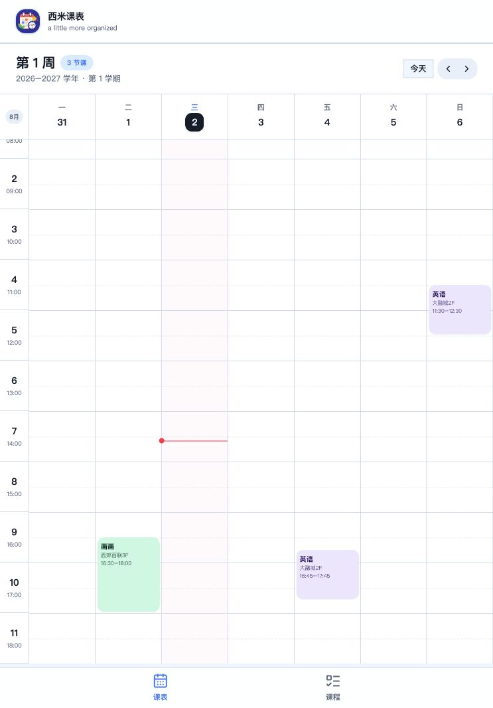
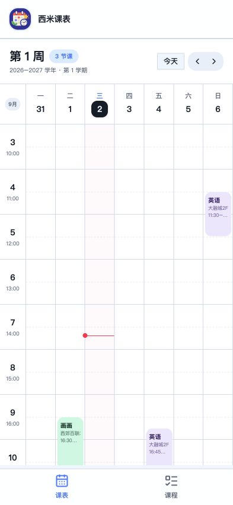
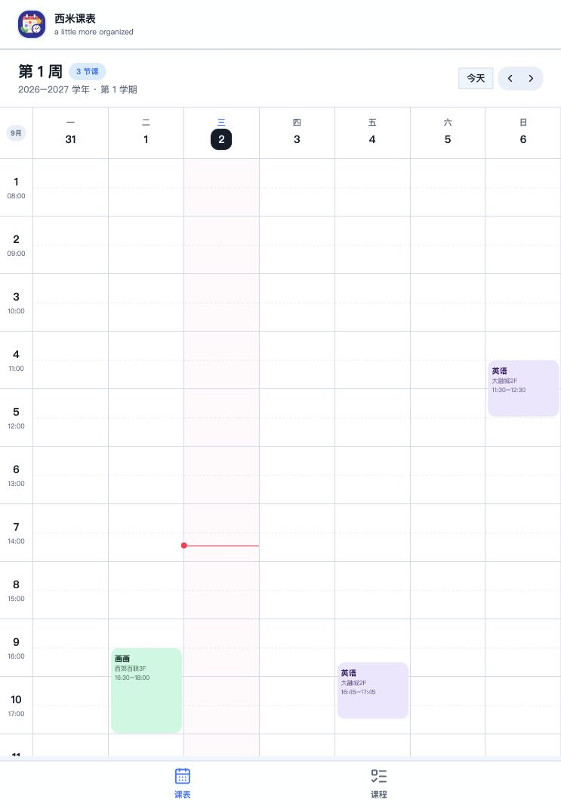

# 课表网格细节审查

## 审查范围

- 页面：周课表 `/`
- 目标：检查时间轴、日期栏、网格边界、初始滚动位置与响应式细节
- 证据：用户提供的两张局部截图，以及本轮修正前后的浏览器截图

## 步骤与结果

### 1. 修正前页面 — 存在结构性错位

- 初始滚动被浏览器限制在非整行的最大滚动位置，表头下方露出一截残行，`08:00` 文本被裁切。
- 日期栏绘制底边，首个小时格又绘制顶边，同一视觉边界由两个元素负责，容易形成重边。
- 跨月周左上角取周一月份，显示成 `8月`，与该周主要日期和侧栏月份不一致。
- 健康状态：需修复。

### 2. 393 × 852 移动端 — 已修复

- 初始位置按 76px 完整课时行对齐，表头下不再出现残行。
- 时间轴与七个日期列共用相同的行高和底边规则。
- 所有七天仍在一个视口内，页面无横向溢出。
- 健康状态：通过。

### 3. 743 × 1066 中等宽度 — 已修复

- 浏览器测量显示表头底边为 `210px`；首个可见时间轴行与课程网格行均从 `210px` 开始。
- 抽查前三行，两侧边界分别为 `210–286`、`286–362`、`362–438`，像素级一致。
- 滚动区域会在尺寸变化后重新对齐完整行，不再因响应式切换产生半行偏移。
- 移动端隐藏滚动条，桌面端使用细滚动条，避免遮住最后一列。
- 健康状态：通过。

## 额外修正

- 网格横线改为由每行的底边单独负责，消除表头与首行的重复描边。
- 月份改取本周中间日期，跨月周显示为 `9月`。
- 仅在当天确有课程时渲染课程数量徽标，避免空圆点。
- 课程筛选行不再显示误导性的整行点击手势。

## 可访问性与证据限制

- 本轮确认了语义标签、键盘可聚焦课程卡和无横向页面溢出。
- 截图能够验证布局、边界和视觉对齐，但不能单独证明所有屏幕阅读器组合下的完整兼容性。

最终结果：通过
